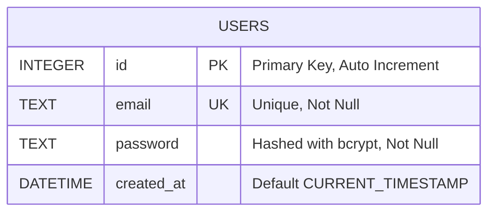
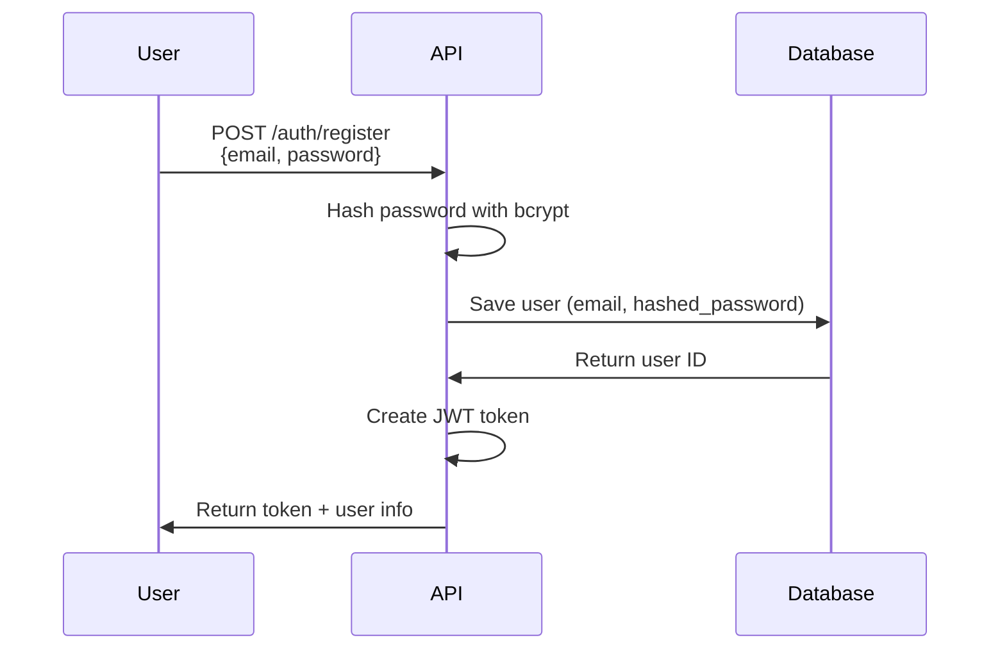
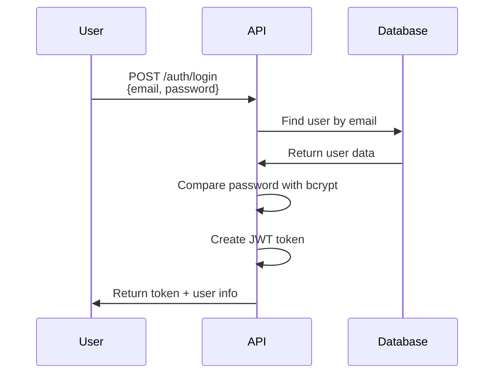
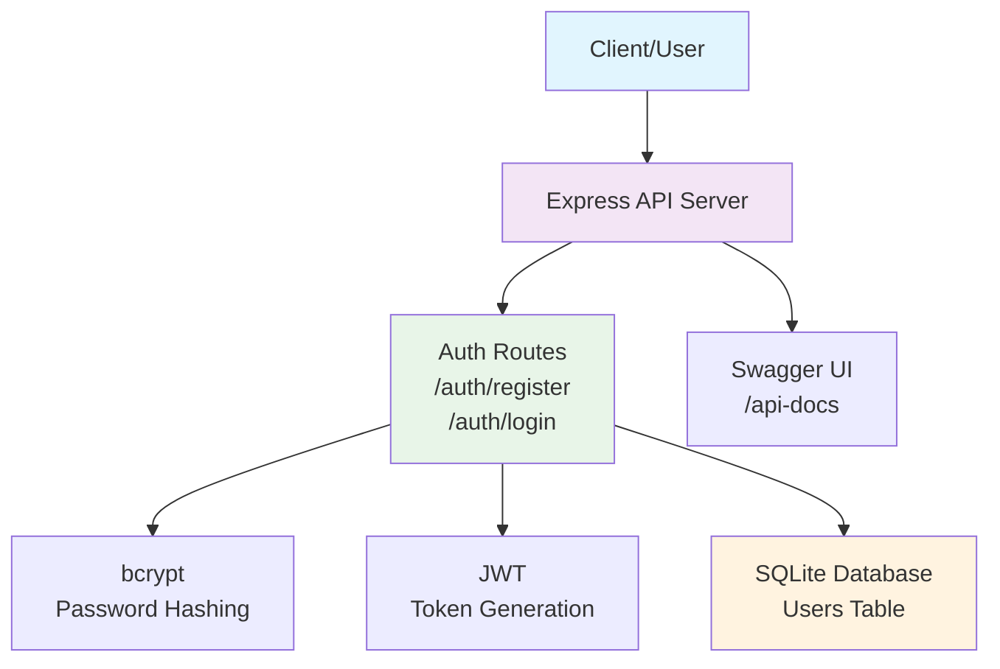

# Authentication System Documentation

## Overview
Authentication system ที่ใช้ JWT tokens สำหรับการรับรองตัวตน พร้อม bcrypt encryption สำหรับ password hashing และ SQLite database สำหรับเก็บข้อมูลผู้ใช้

## Features
- User registration with email and password
- Password hashing using bcrypt
- JWT token-based authentication
- SQLite database for user storage
- Swagger API documentation

## Architecture Diagrams

### Entity Relationship Diagram



### User Registration Flow



### User Login Flow



### Simple System Architecture



## Database Schema

### Users Table
| Column | Type | Constraints | Description |
|--------|------|-------------|-------------|
| id | INTEGER | PRIMARY KEY, AUTOINCREMENT | Unique user identifier |
| email | TEXT | UNIQUE, NOT NULL | User's email address |
| password | TEXT | NOT NULL | Bcrypt hashed password |
| created_at | DATETIME | DEFAULT CURRENT_TIMESTAMP | Account creation timestamp |

## API Endpoints Documentation

### POST /auth/register
**Description:** Register a new user account

**Request Body:**
```json
{
  "email": "user@example.com",
  "password": "securepassword"
}
```

**Success Response (201):**
```json
{
  "message": "User registered successfully",
  "token": "eyJhbGciOiJIUzI1NiIsInR5cCI6IkpXVCJ9...",
  "user": {
    "id": 1,
    "email": "user@example.com"
  }
}
```

**Error Responses:**
- 400: Invalid input or email already exists
- 500: Server error

### POST /auth/login
**Description:** Login with existing user credentials

**Request Body:**
```json
{
  "email": "user@example.com",
  "password": "securepassword"
}
```

**Success Response (200):**
```json
{
  "message": "Login successful",
  "token": "eyJhbGciOiJIUzI1NiIsInR5cCI6IkpXVCJ9...",
  "user": {
    "id": 1,
    "email": "user@example.com"
  }
}
```

**Error Responses:**
- 400: Invalid credentials
- 500: Server error

## Security Features

### Password Security
- **bcrypt Hashing:** All passwords are hashed using bcrypt with salt rounds = 12
- **No Plain Text Storage:** Original passwords are never stored in the database

### JWT Token Security
- **Expiration:** Tokens expire after 24 hours (configurable)
- **Secret Key:** Uses JWT_SECRET environment variable (defaults to 'your-secret-key')
- **Bearer Token:** Uses standard Bearer token format for authentication

### Database Security
- **SQL Injection Prevention:** Uses parameterized queries
- **Unique Email Constraint:** Prevents duplicate user accounts

## Environment Variables
| Variable | Description | Default |
|----------|-------------|---------|
| JWT_SECRET | Secret key for JWT signing | 'your-secret-key' |
| JWT_EXPIRES_IN | Token expiration time | '24h' |

## File Structure
```
src/
├── database/
│   └── database.ts          # SQLite database setup and initialization
├── middleware/
│   └── auth.ts              # JWT authentication middleware
├── models/
│   └── User.ts              # User interface definitions
├── routes/
│   └── auth.ts              # Authentication endpoints
├── utils/
│   └── auth.ts              # Password hashing and JWT utilities
├── swagger.ts               # Swagger configuration
└── index.ts                 # Main application entry point
```

## Testing

### Using Swagger UI
1. Start the server: `npm run dev`
2. Open browser: `http://localhost:3000/api-docs`
3. Test endpoints interactively

### Using curl
```bash
# Register
curl -X POST http://localhost:3000/auth/register \
  -H "Content-Type: application/json" \
  -d '{"email":"test@example.com","password":"123456"}'

# Login
curl -X POST http://localhost:3000/auth/login \
  -H "Content-Type: application/json" \
  -d '{"email":"test@example.com","password":"123456"}'
```

## Development

### Installation
```bash
npm install
```

### Run Development Server
```bash
npm run dev
```

### Build for Production
```bash
npm run build
npm start
```

## Dependencies
- **express:** Web framework
- **typescript:** Type safety
- **bcryptjs:** Password hashing
- **jsonwebtoken:** JWT token handling
- **sqlite3:** SQLite database driver
- **swagger-jsdoc:** Swagger documentation
- **swagger-ui-express:** Swagger UI interface